# 2.	REQUIREMENTS ELICITATION & ANALYSIS
## 2.1.	Competidores.
### 2.1.1.	Análisis Competitivo.

<table>
<thead>
  <tr>
    <th colspan="7">Competitive Analysis Landscape</th>
  </tr>
</thead>
<tbody>
  <tr>
    <td colspan="3" rowspan="2">¿Por qué llevar a cabo este análisis? </td>
    <td colspan="4">¿Cómo&nbsp;&nbsp;&nbsp;identificar a nuestros principales competidores?</td>
  </tr>
  <tr>
    <td colspan="4">Con este análisis, podemos identificar el FODA,&nbsp;&nbsp;&nbsp;es decir, las fortalezas, oportunidades, debilidades y amenazas de nuestros&nbsp;&nbsp;&nbsp;competidores. Asimismo, se evalúa su participación en el mercado y qué&nbsp;&nbsp;&nbsp;estrategias se pueden desarrollar para que nuestra aplicación surja en el&nbsp;&nbsp;&nbsp;mercado laboral. Pero ¿Cómo identificamos a nuestros principales&nbsp;&nbsp;&nbsp;competidores?, Debemos estudiar el mercado e identificar las aplicaciones más&nbsp;&nbsp;&nbsp;usadas por los contratantes del servicio de los profesionales de la salud.&nbsp;&nbsp;&nbsp;Así se concluyó que los principales competidores son:</td>
  </tr>
  <tr>
    <td colspan="2" rowspan="5">(En la cabecera colocar por cada competidor nombre y logo)</td>
    <td colspan="2" rowspan="5">DocSeeker
 

</td>
    <td rowspan="5">MedicApp
 

</td>
    <td rowspan="5">MediQuo
 

</td>
    <td rowspan="5">Heal
 

</td>
  </tr>
  <tr>
  </tr>
  <tr>
  </tr>
  <tr>
  </tr>
  <tr>
  </tr>
  <tr>
    <td rowspan="10">P E R F I L</td>
    <td rowspan="5">Overview</td>
    <td colspan="2" rowspan="5">Ofrecer una lista de profesionales de la salud por medio de una aplicación que integra a doctores, enfermeros o fisioterapeutas que acuden a los domicilios de sus pacientes para realizar un chequeo continuo a su salud, registrando sus avances médicos en la base de datos de la aplicación para que los familiares a cargo del adulto mayor o persona con discapacidad física o mental, pueda visualizar el seguimiento del paciente, desde cualquier lugar de Lima, Perú.</td>
    <td rowspan="5">Ofrecer consultas médicas a domicilio u online para aquellas personas que se contacten con ellos por medio de llamada, correo o por medio de su página web. Se encargan de brindar apoyo a los pacientes por medio de un diagnóstico que se almacena en su sistema, el cual solo puede visualizar el doctor. Asimismo, ofrece servicios de traslado de su domicilio a un hospital o clínica.</td>
    <td rowspan="5">Ofrece un chat de atención médica a las personas que se contacten con ellos por medio de su aplicación y de su página web. En este chat, se resuelven dudas sobre dolencias, malestares y dan un breve diagnóstico ante la situación que el paciente relata. Es una tele consulta escrita con un profesional de la salud aleatorio.</td>
    <td rowspan="5">Ofrece atención primaria a personas que requieran el servicio de un profesional de la salud específicamente en el lugar donde se sientan más cómodos. Es una aplicación conectada con Medicare que es la aplicación de salud del Gobierno de los Estados Unidos y permite acceder a médicos o enfermeros practicantes o graduados certificados. Estableciendo una relación solida entre el paciente y el proveedor para aumentar el nivel de confianza.</td>
  </tr>
  <tr>
  </tr>
  <tr>
  </tr>
  <tr>
  </tr>
  <tr>
  </tr>
  <tr>
    <td rowspan="5">Ventaja   competitiva  ¿Qué valor   ofrece a los   clientes? </td>
    <td colspan="2" rowspan="5">Formalidad y ofrecer una cartera de profesionales de la salud con reseñas de los pacientes anteriores y su tarifa estándar por consulta y/o visita al domicilio del paciente. Asimismo, un registro actualizado de las citas que el paciente ha tenido en el pasado.</td>
    <td rowspan="5">Cuenta con profesionales de la salud con experiencia laboral en instituciones médicas públicas y privadas. Asimismo, cuenta con un laboratorio</td>
    <td rowspan="5">Respuesta inmediata a la consulta médica que el paciente tenga que efectuar.</td>
    <td rowspan="5">Vínculo con Medicare y los planes selectos en esa plataforma federal que permite brindar seguridad y confianza a los posibles contratantes. Su participación en el mercado aumenta constantemente en USA. Con posibles expansiones a México y Sudamérica.</td>
  </tr>
  <tr>
  </tr>
  <tr>
  </tr>
  <tr>
  </tr>
  <tr>
  </tr>
  <tr>
    <td rowspan="21">P E R F I L       D E       M A R K E T I N G</td>
    <td rowspan="18">Mercado objetivo</td>
    <td colspan="2" rowspan="18">Personas que tengan un familiar adulto mayor o con alguna limitación física o mental y que no cuenten con el tiempo necesario para encargarse del cuidado de su familiar y que requiera de tratamiento y de un control remoto de la salud.</td>
    <td rowspan="18">Personas que requieran el apoyo de un profesional para un diagnóstico rápido y seguro.</td>
    <td rowspan="18">Personas con dudas o consultas médicas donde no sea necesario la revisión presencial del paciente.</td>
    <td rowspan="18">Personas mayores en todas las etapas de su proceso de salud, y aquellas que precisen de algún tratamiento.</td>
  </tr>
  <tr>
  </tr>
  <tr>
  </tr>
  <tr>
  </tr>
  <tr>
  </tr>
  <tr>
  </tr>
  <tr>
  </tr>
  <tr>
  </tr>
  <tr>
  </tr>
  <tr>
  </tr>
  <tr>
  </tr>
  <tr>
  </tr>
  <tr>
  </tr>
  <tr>
  </tr>
  <tr>
  </tr>
  <tr>
  </tr>
  <tr>
  </tr>
  <tr>
  </tr>
  <tr>
    <td rowspan="3">Estrategias de marketing</td>
    <td colspan="2" rowspan="3">Hacer uso de publicidad para así obtener un mayor número de usuarios.  Publicidad en Redes Sociales como Facebook, Instagram y Twitter. Pop-ups, banners y anuncios en sitios web pero que no sean intrusivos. Google anuncios. </td>
    <td rowspan="3">Hacer uso de publicidad para así obtener un mayor número de usuarios. Anuncios intrusivos no relacionados al ámbito laboral.</td>
    <td rowspan="3">Hacer uso de publicidad para así obtener un mayor número de usuarios. Posicionamiento en buscadores.</td>
    <td rowspan="3">Hacer uso de publicidad para así obtener un mayor número de usuarios. Posicionamiento en Buscadores. Aparición en medios de comunicación como podcasts, programas televisivos y redes sociales. </td>
  </tr>
  <tr>
  </tr>
  <tr>
  </tr>
  <tr>
    <td rowspan="25">P E R F I L  D E  P R O D U C T O</td>
    <td rowspan="15">Productos &amp;   Servicios </td>
    <td colspan="2" rowspan="15">Servicio de búsqueda de un profesional de la salud.  Servicio de seguimiento continuo, íntegro y seguro al paciente desde su domicilio. Servicio de almacenamiento de la información en un historial médico virtual con acceso desde la aplicación. </td>
    <td rowspan="15">Servicio de médicos a domicilio para un chequeo integral.</td>
    <td rowspan="15">Servicio de preguntas y respuestas de manera inmediata para cualquier disyuntiva médica por medio de su aplicación. Servicio de grupos focalizados relacionados a temas de salud. </td>
    <td rowspan="15">Servicio de médicos, enfermeros o practicantes médicos certificados a domicilio. Servicio de exámenes físicos mensuales y anuales. Servicio de vacunación integrado. </td>
  </tr>
  <tr>
  </tr>
  <tr>
  </tr>
  <tr>
  </tr>
  <tr>
  </tr>
  <tr>
  </tr>
  <tr>
  </tr>
  <tr>
  </tr>
  <tr>
  </tr>
  <tr>
  </tr>
  <tr>
  </tr>
  <tr>
  </tr>
  <tr>
  </tr>
  <tr>
  </tr>
  <tr>
  </tr>
  <tr>
    <td rowspan="7">Precios y Costos</td>
    <td colspan="2" rowspan="7">Paciente: Descarga: Gratuito Contratación: Depende de tarifa del profesional.  Profesional: Retención entre el 5% y 10% de sus ingresos mensuales por concepto de consultas médicas. </td>
    <td rowspan="7">Paciente:  Descarga: Gratuito Contratación: tarifa estándar, no mencionada.  Profesional: No menciona</td>
    <td rowspan="7">Paciente: Descarga: Gratuito Atención: Gratuito   Profesional: 10 – 30 dólares por consulta</td>
    <td rowspan="7">Paciente:  Descarga: Gratuito Contratación: Depende de tarifa del profesional y de lugar de residencia.  Profesional: No menciona</td>
  </tr>
  <tr>
  </tr>
  <tr>
  </tr>
  <tr>
  </tr>
  <tr>
  </tr>
  <tr>
  </tr>
  <tr>
  </tr>
  <tr>
    <td rowspan="3">Canales de   distribución   (Web y/o Móvil) </td>
    <td colspan="2" rowspan="3">Web y Móvil</td>
    <td rowspan="3">Web y Móvil</td>
    <td rowspan="3">Web y Móvil</td>
    <td rowspan="3">Web y móvil</td>
  </tr>
  <tr>
  </tr>
  <tr>
  </tr>
  <tr>
    <td rowspan="21">A N Á L I S I S  S W O T</td>
    <td colspan="6" rowspan="10">Realice esto para su startup y sus competidores. Sus fortalezas deberían apoyar sus oportunidades y contribuir a lo que ustedes definen como su posible ventaja competitiva.</td>
  </tr>
  <tr>
  </tr>
  <tr>
  </tr>
  <tr>
  </tr>
  <tr>
  </tr>
  <tr>
  </tr>
  <tr>
  </tr>
  <tr>
  </tr>
  <tr>
  </tr>
  <tr>
  </tr>
  <tr>
    <td rowspan="5">Fortalezas</td>
    <td colspan="2" rowspan="5">- Confianza. -Reseñas y elección del contratante. -Rápida respuesta. -Atención las 24 horas. -Asociación con farmacias para la compra y envío de medicamentos             </td>
    <td rowspan="5">-Gran participación en el mercado</td>
    <td rowspan="5">-Atención efectiva y al instante.</td>
    <td rowspan="5">-Gran participación en el mercado y con aumento constante -Vínculo con Medicare</td>
  </tr>
  <tr>
  </tr>
  <tr>
  </tr>
  <tr>
  </tr>
  <tr>
  </tr>
  <tr>
    <td rowspan="2">Debilidades</td>
    <td colspan="2" rowspan="2">Nuevo en el mercado de aplicaciones de búsqueda de profesionales de la salud.</td>
    <td rowspan="2">Horario de atención establecido de 8 am a 8 pm. El contratante no selecciona el profesional.</td>
    <td rowspan="2">Su idea de negocio puede ser fácilmente imitada, pues es solo un chat de respuesta inmediata.</td>
    <td rowspan="2">-Horario de atención de 8:00 am a 6:00 pm -Sistema de atención y reserva de citas deficiente e irregular.</td>
  </tr>
  <tr>
  </tr>
  <tr>
    <td rowspan="3">Oportunidades</td>
    <td colspan="2" rowspan="3">Tomar las funcionalidades deficientes de los aplicativos existentes e implementarlo para su beneficio. Mercado actual en crecimiento. </td>
    <td rowspan="3">Aumento de público en interacción con aplicaciones relacionadas al tema de salud por la coyuntura actual y nuevos convenios con instituciones médicas privadas.</td>
    <td rowspan="3">Aumento de la tele consultas y de los medios de comunicación tecnológicos integrados con sistemas de chat.</td>
    <td rowspan="3">Ampliar su zona de atención a nivel nacional en los Estados Unidos.  Expansión de su atención a México y América del Sur.</td>
  </tr>
  <tr>
  </tr>
  <tr>
  </tr>
  <tr>
    <td>Amenazas</td>
    <td colspan="2">Mucha Competencia</td>
    <td>Software e interfaz de interacción desactualizados.</td>
    <td>Falta de actualización de la máquina virtual integrada para respuestas aleatorias ante problemas de salud comunes.</td>
    <td>Sistema de atención, reserva de citas y facturación con deficiencias que perjudican su imagen con los contratantes.</td>
  </tr>
</tbody>
</table>

### 2.1.2.	Estrategias y tácticas frente a competidores.

1.	Aplicaremos una estrategia de supervisión de los indicadores de desempeño para evaluar el porcentaje de éxito en cada contratación del profesional de salud para medir las métricas de rendimiento de nuestra aplicación y sugerir cambios para el beneficio del usuario.
2.	La segunda estrategia es desarrollar un ataque en cadena, como estamos inmersos en un ámbito tecnológico, no puedes atacar directamente al competidor más potente, pues cuenta con más medios que nosotros y podría ser contraproducente. Entonces debemos ir obteniendo mayor participación en el mercado atacando los mercados más pequeños y posicionándonos directamente en ellos.
3.	La tercera estrategia por desarrollar es la maniobra envolvente, nosotros debemos evidenciar las debilidades de cada competidor y tomarlas en cuenta para mejorar nuestro producto.
4.	La cuarta estrategia consiste en implementar una interfaz de búsqueda y envío de medicamentos a domicilio, para esto realizaremos asociaciones con las farmacias más conocidas en Perú (Mifarma, Inkafarma, etc.). De esta manera le permitimos al usuario obtener la medicación de forma más cómoda y rápida. Como la información de la receta médica y la dirección del usuario está registrada en nuestro sistema, dicha información será compartida con la farmacia, la cual a través de su servicio de delivery propio se hará cargo del envío. Esto nos permite tener ventaja adicional sobre nuestra competencia.
5.	Finalmente, emplearemos la estrategia competitiva de diferenciación, consta en ofrecer un producto diferente con una interfaz única y con mejoras totalmente pensadas en la satisfacción del usuario.

## 2.2.	Entrevistas.

En este punto presentaremos los resultados de las entrevistas realizadas a los usuarios objetivos.

### 2.2.1.	Diseño de entrevistas.

En esta sección, mostraremos las preguntas que hemos generado para realizar las entrevistas a los dos tipos de usuarios objetivos. Cabe destacar, que las preguntas realizadas son de tipo abierto, con el objetivo de recolectar información relevante que nos ayude a tener una idea más precisa de cómo solucionar problemas de nuestros usuarios objetivos.

**Preguntas principales y complementarias para la entrevista**

**1.	Personas con dificultad para movilizarse o sus familiares:**

**a.	Preguntas principales:**
*	¿Cuáles son los principales motivos por el cual usted contrataría el servicio de un profesional de la salud a domicilio?
*   ¿Cuál es la mayor dificultad que ha identificado en el tiempo que lleva cuidando a su familiar?
*	¿Cuáles son las dificultades que ha encontrado en el servicio de clínica en la atención a su familiar? 
*	¿Confiaría usted en una aplicación que le ayude a obtener un profesional de la salud calificado para cuidar a su familiar?
*	¿Cuáles serían los factores que determinan su confianza en un sistema web de atención a domicilio? 
*	¿Qué tan importante es para usted tener el control de elegir (personalizar) a su profesional de la salud? 
*	¿Considera una ventaja tener un registro actualizado de cada análisis que se le realiza a su familiar con limitación para un monitoreo más íntegro? 
*	¿Considera que su trabajo u otras áreas de su vida se ven afectadas por el tiempo que debe dedicar a cuidar a su familiar? 

**b.	Preguntas complementarias:**
*	¿Cuántos años tiene?
*	¿En qué distrito reside?
*   ¿Cuál es su estado civil?
*	¿Cuál es su ocupación?
*	Mencione algunas de sus habilidades, por favor.
*	¿Cuáles son sus dispositivos de preferencia?
*	¿Cuáles son sus principales frustraciones?
*	¿Cuánto tiempo le toma el cuidado de su familiar discapacitado diariamente? 
*	¿Su familiar requiere de algún medicamento o tratamiento? y si así fuera ¿Quién es el responsable de administrar su medicina?

**2.	Personal de la salud:**

**a.	Preguntas principales:**
*	¿Cuál es el factor principal por el cual los adultos mayores optan por no acudir a los centros médicos? 
*	¿Cuánta experiencia tiene usted como cuidador de personas mayores y/o personas con limitaciones físicas o mentales?
*	¿Con cuánta frecuencia atiende a personas con alguna discapacidad física, mental o de otra índole? 
*	¿Cuál es el problema más frecuente que se da cuando familiares no capacitados se encargan de administrar el tratamiento médico de algún paciente con limitaciones físicas, mentales o con presencia de enfermedades crónicas?
*	¿Cuáles son las diferencias de ser un médico de casa a uno de clínica? 
*	¿Qué características/opciones le gustaría que tuviera nuestra plataforma?
*	¿Qué opina acerca de que usted pueda colocar su propia tarifa de servicio?
*	¿Considera una ventaja para usted que en una plataforma se le pueda valorar su servicio a través de reseñas o puntuaciones? 
*	¿Cuál sería el porcentaje apropiado que estaría dispuesto a descontar de sus ingresos mensuales por conceptos de captación de pacientes a través de una aplicación?

**b.	Preguntas complementarias:**
*	¿Cuántos años tiene?
*	¿En qué distrito reside?
*	¿Cuál es su estado civil?
*	¿Cuál es su ocupación?
*	¿Cuáles son sus dispositivos de preferencia?
*	¿Cuáles son sus principales frustraciones?
*	¿Cómo reacciona ante situaciones de gran estrés o cómo maneja eficazmente el estrés personal en su trabajo como profesional de la salud? 
*	¿Cómo le han ayudado sus habilidades de escucha a entender y diagnosticar correctamente las necesidades de sus pacientes? 

**Respuestas a las preguntas complementarias por cada entrevistado:**
1.	**Segmento 1: Personas con dificultad para movilizarse o sus familiares**

**a.	Entrevistado 1 – Alexis Frogoziolo:**
*	Edad: 25 años
*	Residencia: Comas
*	Estado Civil: Soltero
*	Ocupación: Estudiante
*	Dispositivos de preferencia: Celular y Laptop
*	Habilidades: Buen manejo de situaciones difíciles. 
*	Frustraciones: No tener a nadie que supervise a su familiar.

**b.	Entrevistado 1 – Nicolas Haro:**
*	Edad: 22 años
*	Residencia: Surco
*	Estado Civil: Soltero
*	Ocupación: Estudiante
*	Dispositivos de preferencia: Celular y Laptop
*	Habilidades: Buen manejo de situaciones difíciles. 
*	Frustraciones: Ninguno.

2.	**Segmento 2: Profesionales de la salud**

**a.   Entrevistado 2 – Nicoll Abarca:**
*	Edad: 26 años
*	Residencia: Miraflores
*	Estado civil: Soltera
*	Ocupación: Fisioterapeuta
*	Dispositivos de preferencia: Laptop.
*	Habilidades: Manejo adecuado de estrés, angustia en las situaciones.
*	Frustraciones: Ninguna.

**b.  Entrevistado 2 – Julio Cesías:**
*	Edad: 50 años.
*	Residencia: San Miguel
*	Estado civil: Conviviente
*	Ocupación: Médico Oftalmólogo
*	Dispositivos de preferencia: Laptop, Tablet.
*	Habilidades: Paciencia. 
*	Frustraciones: Ninguno.

**c.  Entrevistado 3 – Zaira Salazar:**
*	Edad: 51 años.
*	Residencia: Lima
*	Estado civil: Casada
*	Ocupación: Enfermera Hospital del Niño
*	Dispositivos de preferencia: Celular.
*	Habilidades: Paciencia. 
*	Frustraciones: Ninguno.

### 2.2.2.	Registro de entrevistas.
**Segmento 1: Personas con dificultad para movilizarse o sus familiares**
1.	Entrevistado 1:
      *	Nombres y Apellidos: Alexis Frogoziolo Lujan.
      * Edad: 25 años
      *	Distrito: Comas
      *	Evidencia de la reunión:
           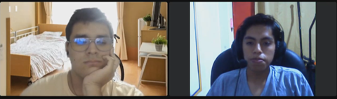
      *	URL de stream: https://web.microsoftstream.com/video/5c81c331-6307-4c7a-a2e5-148e2ff388d7
      *	Timing y duración: 0:00 – 4:43	
      *	Resumen sobre la entrevista: 

      La entrevista fue realizada a Alexis Frogoziolo Lujan, tiene 25 años y reside en Comas. Es un estudiante universitario, soltero y sus dispositivos de preferencia son su celular y su laptop. Sus principales canales digitales de interacción son WhatsApp e Instagram. Cuenta con habilidades como saber actuar en momentos difíciles. Además, cuenta con ciertas frustraciones como el estrés por el tiempo que cuida a su familiar discapacitado y no poder ayudar en todo a su abuela. Como se mencionó, él es una de las personas que se encargan del cuidado de un familiar con discapacidades, la cual necesita siempre de la compañía de alguien para su supervisión. Por ello, Alexis menciona que la ayuda o atención de un profesional de la salud en su domicilio le facilita el cuidado de su abuela, ya que ella requiere de constante observación y no puede realizar sus labores diarias sin preocuparse por si su familiar sigue con vida. Además, nos comentó que ha habido ciertas dificultades cuando lleva a su familiar a los hospitales, las cuales son como la demora de atención a los pacientes. De igual forma, Alexis asegura que son solo los familiares quienes se encargan de aplicar los medicamentos que son necesarios en el cuidado de su familiar. Por otro lado, con respecto a las plataformas de salud virtuales, él menciona que el principal factor de confianza en un doctor es que este sea verificado con papeles que avalen sus estudios, también piensa que el poder visualizar las recomendaciones, opiniones o experiencias de otros pacientes le sería de gran ayuda. Además, el entrevistado considera fundamental monitorear y controlar los análisis médicos hechos a su familiar. 

2. Entrevistado 2:
   *	Nombres y Apellidos: Nicolas Haro
   *	Edad: 22 años
   *	Distrito: Surco
   *	Evidencia de la reunión:
        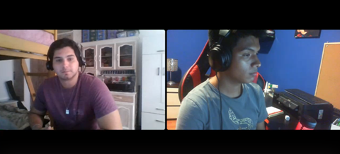
   *	URL del Stream: https://web.microsoftstream.com/video/fb420e56-41aa-4d79-bca6-7e4f05c4b69e 
   *	Timing y duración: 0:00 – 4:49
   *	Resumen sobre la entrevista: 

   Esta entrevista fue realizada a Nicolas Haro, el cual tiene 22 años y reside en Surco- Lima. Actualmente soltero y estudiante de la UPC. Su dispositivo de preferencia es el celular. Las habilidades con las que se describe son que aprende muy rápido, se explaya con bastante facilidad y es muy hábil socialmente hablando. Nos cuenta que se siente frustrado por la poca empatía que hay en la sociedad con las personas discapacitadas, dice que en la ciudad de Lima debido al tránsito de personas no se les toma mucha importancia a las personas discapacitadas. En su experiencia con las clínicas, el siente que no se les da mucha importancia, ya que, si bien están en una situación delicada, no es tomada como de riesgo. Con respecto a nuestra aplicación, nos comenta que, debido a su situación, no es muy cómodo andarse moviendo de un lugar a otro como en este caso las clínicas, por ello siente que sería mucho mejor si le asistieran personalmente en su domicilio. Finalmente comenta que el factor que determinaría su confianza en nuestro sistema web es poder ver el trabajo que han realizado o curricular de los trabajadores de nuestra aplicación.

**Segmento 2: Profesionales de la salud**
1. Entrevistado 1:
   *	Nombres y Apellidos:  Nicoll Abarca Cabrera
   *	Edad: 26 años
   *   Distrito: Miraflores
   *	Evidencia de la reunión:
        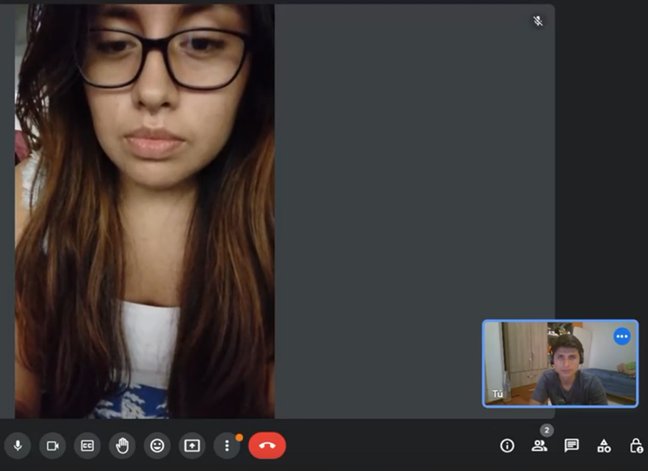
   *	URL de stream: https://web.microsoftstream.com/video/2b0f8d77-6af1-48d3-87cc-c592eb680c18 
   *	Timing y duración: 0:00 – 7:14
   *	Resumen sobre la entrevista:
   
   La entrevistada Nicoll Abarca Cabrera labora actualmente en la clínica FisioProgres. Reside en el Miraflores, se encuentra soltera y tiene 26 años, sus dispositivos de preferencia son los dispositivos móviles como su celular. Nicoll nos cuenta de que el estrés en su trabajo es muy frecuente por lo que ella hace ejercicio en casa para sobrellevar el estrés del trabajo. La entrevistada nos comenta que una de las razones principales por las cuales los adultos mayores no quieren ir a los centros médicos es debido a que muchos de ellos no quieren ser una carga para sus familias y también por la situación de la pandemia. Además, Ella tiene 3 años de experiencia cuidando a personas con discapacidad física o mental, y adultos mayores, usualmente ella los atiende 3 días a la semana. Según Nicoll, ella piensa que automedicar a un paciente sin una receta médica es muy negligente por parte de los familiares, ya que en algunos casos estos empeoran y algunas hasta llegan a morir por tomar los medicamentos y las dosis inadecuadas. Así también, la entrevistada considera que un médico de casa suele ofrecer atención médica general y preventiva, mientras que un médico de clínica puede tener una especialización y ofrecer servicios más especializados y complejos en un entorno de atención médica más amplio. 

2. Entrevistado 2:
   *	Nombres y Apellidos: Julio César Cesías López
   *	Edad: 50 años
   *	Distrito: San Miguel
   *	Evidencia de la reunión:
        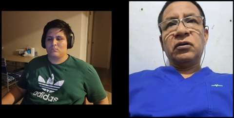
   *	URL de stream: https://web.microsoftstream.com/video/e3af4971-58d3-40e4-b21f-32b7f169c4bb
   *	Duración: 0:00 – 12:14
   *	Resumen sobre la entrevista:

   El entrevistado es el médico oftalmólogo Julio César Cesías López de 50 años, procedente de Lima, San Miguel y actualmente trabaja en Minsa. Sus dispositivos de preferencia son laptop y tablet. Mencionó que tiene mucha experiencia con el cuidado a personas, en este caso cuidados del tipo oftalmológicos a sus pacientes. Nos comenta que la principal razón que logró visualizar a el por qué las personas no asisten a sus citas es, en primer lugar, la distancia desde su hogar al destino y, en segundo lugar, sería su estado económico. Luego mencionó que la gran parte de personas adultas mayores tratan de automedicarse y eso en muchos casos en lugar de solucionar el problema lo empeoran. De igual manera mencionó que le parece muy importante conocer la opinión de sus clientes sobre cómo se sintieron mientras estuvieron en la cita. Finalmente, comentó que si estaría dispuesto por pagar tarifas en sus consultas, solo si la herramienta le proporciona realmente lo necesario y en correcto funcionamiento.

3. Entrevistado 3:
   *	Nombres y Apellidos: Ruth Zaira Salazar
   *	Edad: 51 años
   *	Distrito: Lima
   *	Evidencia de la reunión:
        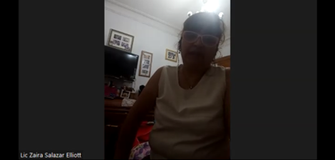
   *	URL de stream: https://web.microsoftstream.com/video/4e58e484-c56a-4af7-96e9-57bd5605f1db 
   *	Duración: 0:00 – 8:23
   *	Resumen sobre la entrevista:
   
   La entrevistada Ruth Zaira Salazar Elliott labora actualmente en el Hospital del Niño. Reside en Lima, se encuentra casada y tiene 51 años, sus dispositivos de preferencia son los dispositivos móviles. La entrevistada nos cuenta que tiene habilidad del manejo de estrés y angustia en los horarios de trabajo. La señora Ruth comenta que la razón principal por la que los adultos mayores optan por no ir a los centros médicos se debe al tiempo que esto les consume y el costo de estos servicios. Además, sus años de experiencia laboral le han permitido estar familiarizada a conocer más a fondo a sus pacientes, debido a que en todos los días de trabajo tiene que cuidar a pacientes con limitaciones físicas y/o mentales. Según la enfermera Ruth, ella considera que el problema más frecuente cuando los familiares se encargan del cuidado de los pacientes es que estos no están capacitados y no saben cuáles son los cuidados necesarios que se deben realizar, además, que se encuentran desesperados y ansiosos, no tienen técnicas para manejar el estrés, por lo que terminan dando un tratamiento indebido o servir la cantidad incorrecta de dosis en los medicamentos recetados a los pacientes. Así también, la entrevistada considera que la mayor diferencia entre un médico de casa a uno de clínica es que al ser uno de casa, el cuidado que se brindará será exclusivamente al paciente en específico, pudiendo dedicar las 8 horas laborales directamente a este paciente, por lo que le brindarán un cuidado más privilegiado y cuidadoso. En cuanto a la idea de que pueda colocar su propia tarifa por sus servicios médicos, se encuentra de acuerdo. En cuanto a la idea de la posibilidad de dejar una puntuación y reseña del servicio realizado considera que está bien para una plataforma, y en esa misma clase de plataforma la señora Ruth estaría dispuesta a dar un 5% o hasta 10% de sus ganancias mensuales a dicha plataforma que la ayude en la captación de pacientes.

### 2.2.3.	Análisis de entrevistas.

A continuación, se desarrolla una estrategia en conjunto con el equipo para identificar los puntos en común en base a las respuestas de cada entrevistado a cada pregunta. Esto nos ayuda a realizar un análisis más conciso y seguro para desarrollar nuestra aplicación en base a la información recolectada.

**Puntos en común:**

**Segmento 1: Personas con dificultad para movilizarse o sus familiares**

**¿Cuáles son los principales motivos por el cual usted contrataría el servicio de un profesional de la salud a domicilio?**  
*	El 100% de los entrevistados concuerdan en que el principal motivo por el cual contratan el servicio de un profesional de la salud a domicilio es para que se ocupen de todas las necesidades médicas de su familiar en la comodidad de su hogar, ya que es muy riesgoso y cansado para ellos el movilizarse. 

**¿Cuál es la mayor dificultad que ha identificado en el tiempo que lleva cuidando a su familiar?**  
*	El 100% de los entrevistados coinciden en que la mayor dificultad al momento de cuidar de un familiar con limitaciones es la mala atención en los centros de salud, sobre todo en los públicos. 

**¿Cuánto tiempo le toma el cuidado de su familiar discapacitado diariamente?** 
*	En base a las entrevistas, se deduce que el tiempo que se invierte en el cuidado del familiar varía entre 4 a 12 horas dependiendo de las actividades que se tengan que realizar en el día. Sin embargo, les cuesta realizar sus actividades normales debido al miedo de que sus familiares resulten lastimados cuando estén solos. 

**¿Su familiar requiere de algún medicamento o tratamiento? y si así fuera ¿Quién es el responsable de administrar su medicina?** 
*	El 50% de los entrevistados indica que sus familiares requieren la administración de medicamento constantemente, la cual es brindada por el familiar que se encuentre en casa. 

**¿Cuáles son las dificultades que ha encontrado en el servicio de clínica en la atención a su familiar?** 
*	El 50% de los entrevistados afirma que el tiempo de espera es muy lento, lo cual no satisface las necesidades del enfermo. 

**¿Cuáles serían los factores que determinan su confianza en un sistema web de atención a domicilio?**  
*	El 100% de los entrevistados consideran que la seguridad de los datos, como su curriculum o las opiniones de los pacientes anteriores. es uno de los factores que determinarían su confianza en una plataforma digital. 
 
**¿Qué tan importante es para usted tener el control de elegir (personalizar) a su profesional de la salud?**  
*	El 100% de los entrevistados coinciden en que es de suma importancia poder elegir al profesional de la salud que acudirá a su domicilio. Sin embargo, les parece más importante que la aplicación te recomiende los profesionales de salud según los síntomas que presenten. 

**¿Considera una ventaja tener un registro actualizado de cada análisis que se le realiza a su familiar con limitación para un monitoreo más íntegro?**  
*	El 100% de los entrevistados opina que el registro actualizado de cada análisis que se le realiza a su familiar es de suma importancia, pues permite acceder a la información sobre la condición actual del paciente. 

**¿Considera que su trabajo u otras áreas de su vida se ven afectadas por el tiempo que debe dedicar a cuidar a su familiar?**  
*	El 100% de los entrevistados afirma que varios aspectos de su vida se ven afectados por esto ya que reduce el tiempo disponible durante el día para realizar sus labores cotidianas. 

Análisis General de las entrevistas del Segmento objetivo **Familiares de personas con dificultad para movilizarse o alguna limitación física o mental:** 

Haciendo un análisis general de las entrevistas se puede evidenciar lo siguiente. La totalidad de los entrevistados coincide en que la mayor dificultad que se presenta durante el cuidado de algún familiar es la movilidad (100%), lo cual les consume mucho tiempo, por lo que varios aspectos de su vida se ven afectados debido a esto (labores diarias). Asimismo, consideran que es un aspecto muy importante que la aplicación le recomiende el personal médico y llevar un registro de los análisis de su familiar (100%). Sin embargo, para que esto sea viable es necesario que la seguridad de la aplicación sea alta ya que se estaría trabajando con los datos personales de los clientes, al igual que con los datos del personal de médico. Por otro lado, se identificó que, de los entrevistados, 2 eran hombres, y el margen de edades iba desde los 19 hasta los 25 años. Todos ellos vivían en Lima Metropolitana, pero en distintos distritos. La ocupación de cada uno era la misma, ambos eran solteros, los dispositivos que utilizaban son laptop y celular, todos utilizan WhatsApp e Instagram, cada uno posee distintas habilidades y, para terminar, 2 de ellos están frustrados por el deterioro de la salud de sus seres queridos.  

**Segmento 2: Profesionales de la salud**

**¿Cuál es el factor principal por el cual los adultos mayores optan por no acudir a los centros médicos?** 
*	Un 100% de los entrevistados menciona que la razón principal es debido al tiempo y costo que este les ocasiona al tener que viajar cada vez que necesitan de atención médica.

**¿Cuánta experiencia tiene usted como cuidador de personas mayores y/o personas con limitaciones físicas o mentales?** 
*	El 100% de los entrevistados tiene mucha experiencia médica sobre el cuidado de personas con limitaciones físicas y/o mentales. 

**¿Con cuánta frecuencia atiende a personas con alguna discapacidad física, mental o de otra índole?** 
*	El 66,6% de los entrevistados mencionan que atienden con frecuencia a personas con alguna discapacidad, que en su mayoría presentan limitaciones físicas.

**¿Cuál es el problema más frecuente que se da cuando familiares no capacitados se encargan de administrar el tratamiento médico de algún paciente con limitaciones físicas, mentales o con presencia de enfermedades crónicas?** 
*	El 100% de los entrevistados asegura que el desconocimiento del familiar, a cargo del cuidado del paciente, perjudica su condición. En otras palabras, no controlar o tratar la enfermedad de forma incorrecta puede agravar la condición del paciente.
*	Un 33.3% de los entrevistados mencionó que hay algunos adultos mayores que no tienen de cuidadores y terminan automedicándose, ocasionando que empeore su estado actual.
*	Además, el 100% de los entrevistados mencionan que los familiares desconocen cómo llevar un tratamiento. Por ejemplo, tienen dificultades cuando necesitan medir la cantidad de las dosis de los medicamentos y tampoco saben cómo dárselo al paciente cuando este se rehúsa a tomarlo.

**¿Cuáles son las diferencias de ser un médico de casa a uno de clínica?** 
*	El 100% de entrevistados coincide en que, a diferencia del médico de clínica, el médico de casa genera una mayor conexión con el familiar, por el tiempo que tiene para solo un paciente. 
*	Además, los entrevistados afirman que otra diferencia ventajosa para el paciente, es que la identificación entre paciente y médico es más abierta lo que permite que exista mayor comodidad para ambos. La atención es preferencial y existe una ayuda más efectiva, porque el médico de casa solo está enfocado en una persona.

**¿Qué opina acerca de que usted pueda colocar su propia tarifa de servicio?**
*	El 100% de los entrevistados está de acuerdo en poder colocar su propia tarifa. Así los clientes tendrán variedad para escoger al profesional de su preferencia.
*	Además, mencionan que es una medida justa y adecuada, ya que, dependiendo cada paciente que se les es asignado, el esfuerzo y los conocimientos que deben poseer y aplicar pueden variar. Por ejemplo, un paciente que puede caminar requiere de menos cuidados que un paciente con alguna discapacidad física. 

**¿Considera una ventaja para usted que en una plataforma se le pueda valorar su servicio a través de reseñas o puntuaciones?** 
*	El 100% de los entrevistados creen que es una característica positiva en el servicio, ya que podrán adquirir recomendaciones por el buen trabajo que realicen.

**¿Cómo reacciona ante situaciones de gran estrés o cómo maneja eficazmente el estrés personal en su trabajo como profesional de la salud?**
*	El 66,6% de los entrevistados, mencionan que ponen en práctica actividades de control de estrés como por ejemplo reflexionar de lo que debe y puede hacer o acudir a terapia para relajarse y buscar soluciones efectivas.
*	El 33,3% de los entrevistados mencionan que ponen en práctica sus habilidades de inteligencia emocional y siempre se mantienen serenos antes situaciones altamente estresantes. También, tienen un buen manejo de emociones.

**¿Cómo le han ayudado sus habilidades de escucha, a entender y diagnosticar correctamente las necesidades de sus pacientes?** 
*	El 100% de los entrevistados considera que las habilidades de escuchar les ayudan a comprender mejor a sus pacientes y diagnosticarlos de manera eficaz.

**¿Cuál sería el porcentaje apropiado que estaría dispuesto a descontar de sus ingresos mensuales por conceptos de captación de pacientes a través de una aplicación?** 
*	El 100% de los entrevistados está dispuesto a pagar entre el 5% al 10% de su sueldo mensual por el concepto de captación de cliente. Es importante recalcar, que la entrevistada menciona que este porcentaje debe variar dependiendo el monto que se le va a pagar.

Análisis General de las entrevistas del Segmento objetivo **Profesionales de la salud:**

Haciendo un análisis general de las entrevistas se puede evidenciar lo siguiente. La totalidad de los entrevistados cuenta con bastante experiencia respecto al cuidado de personas con limitaciones físicas y/o mentales. Asimismo, consideran que es peligroso que una persona no experimentada, familiar del paciente en este contexto o ellos mismos realizando automedicación, aplique los tratamientos o medicamentos al paciente ya que no tienen el conocimiento adecuado. Por otro lado, están de acuerdo en que nuestra plataforma les permita colocar su propia tarifa por concepto de atentación ya que de esta forma los usuarios podrán elegir al profesional de la salud que mejor le convenga y, después de realizado el tratamiento se le pueda calificar a través de reseñas o puntuaciones, esto no solo les permitiría obtener una retroalimentación de su servicio sino también una oportunidad de que los demás usuarios lo conozcan y elijan para tratar a sus familiares. Sin embargo, una gran parte de ellos (66,6%) no está dispuesto a tener una retención del 10% de sus ingresos mensuales. Por otro lado, 2 de los 3 entrevistados fueron mujeres, el margen de edades iba desde los 26 hasta los 51 años, 1 vive en Lima, 1 en Miraflores y 1 en San Miguel, los 3 trabajan en alguna rama de la medicina, 2 de los 3 ya se encontraban casados, 2 de los 3 utilizaban laptop y celular, los 3 utilizan WhatsApp, 2 de los 3 saben actuar en momentos de estrés y, para terminar, los 3 tienen distintas frustraciones.

## 2.3.	Needfinding
### 2.3.1.	User Personas.
A continuación, se construirán los User Persona de cada segmento objetivo de nuestra plataforma. Para ello, se utilizarán los datos recolectados de las entrevistas realizadas; principalmente, los que muestran los objetivos, motivaciones y frustraciones con las que cuentan cada uno de los sectores que conforman al público al que va dirigida la aplicación. Es decir, se presentará tanto un estereotipo de un familiar de una persona discapacitada, como uno de un profesional de la salud.

**User Persona – Familiares de pacientes con discapacidad o alguna limitación.**

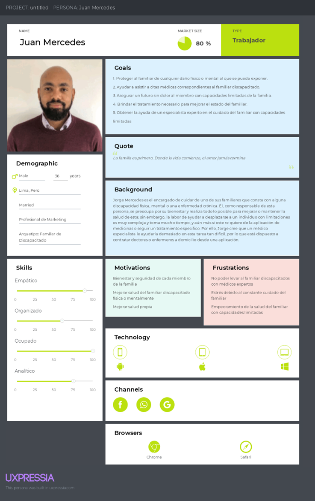

**User Persona – Profesionales de la Salud (Doctores, enfermeros, etc.).** 

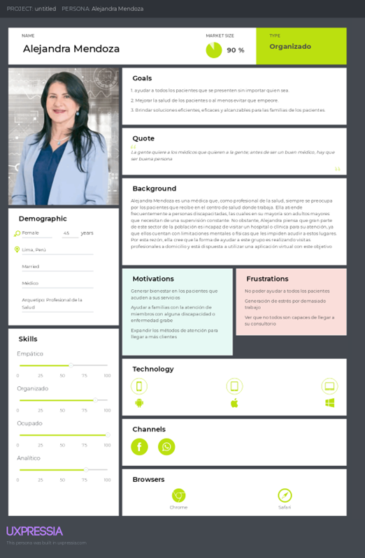

### 2.3.2.	User Task Matrix.
En esta etapa nos enfocaremos en las tareas que los User Personas familiares de adultos mayores o personas con limitación física o mental, representados por Juan Mercedes. Asimismo, el segundo User Persona que son los profesionales de la salud, representados por Alejandra Mendoza. realizan para alcanzar su propósito, teniendo como segmentos objetivos a los pacientes con dificultades para movilizarse o sus familiares y, los profesionales de la salud. 

<table>
<thead>
  <tr>
    <th rowspan="2">    User Task Matrix.   </th>
    <th colspan="2">&nbsp;&nbsp;&nbsp; Juan Mercedes&nbsp;&nbsp;&nbsp;</th>
    <th colspan="2">&nbsp;&nbsp;&nbsp; Alejandra Mendoza&nbsp;&nbsp;&nbsp;</th>
  </tr>
  <tr>
    <th>&nbsp;&nbsp;&nbsp; Frecuencia&nbsp;&nbsp;&nbsp;</th>
    <th>&nbsp;&nbsp;&nbsp; Importancia&nbsp;&nbsp;&nbsp;</th>
    <th>&nbsp;&nbsp;&nbsp; Frecuencia&nbsp;&nbsp;&nbsp;</th>
    <th>&nbsp;&nbsp;&nbsp; Importancia&nbsp;&nbsp;&nbsp;</th>
  </tr>
</thead>
<tbody>
  <tr>
    <td>    Supervisar el comportamiento del paciente durante el día   </td>
    <td>&nbsp;&nbsp;&nbsp; Always&nbsp;&nbsp;&nbsp;</td>
    <td>&nbsp;&nbsp;&nbsp; High&nbsp;&nbsp;&nbsp;</td>
    <td>&nbsp;&nbsp;&nbsp; Always&nbsp;&nbsp;&nbsp;</td>
    <td>&nbsp;&nbsp;&nbsp; High&nbsp;&nbsp;&nbsp;</td>
  </tr>
  <tr>
    <td>    Ayudar a movilizar a los pacientes     </td>
    <td>&nbsp;&nbsp;&nbsp; Always&nbsp;&nbsp;&nbsp;</td>
    <td>&nbsp;&nbsp;&nbsp; Medium&nbsp;&nbsp;&nbsp;</td>
    <td>&nbsp;&nbsp;&nbsp; Always&nbsp;&nbsp;&nbsp;</td>
    <td>&nbsp;&nbsp;&nbsp; High&nbsp;&nbsp;&nbsp;</td>
  </tr>
  <tr>
    <td>&nbsp;&nbsp;&nbsp; Realizar exámenes médicos&nbsp;&nbsp;&nbsp;</td>
    <td>&nbsp;&nbsp;&nbsp; Rarely&nbsp;&nbsp;&nbsp;</td>
    <td>&nbsp;&nbsp;&nbsp; High&nbsp;&nbsp;&nbsp;</td>
    <td>&nbsp;&nbsp;&nbsp; Always&nbsp;&nbsp;&nbsp;</td>
    <td>&nbsp;&nbsp;&nbsp; High&nbsp;&nbsp;&nbsp;</td>
  </tr>
  <tr>
    <td>    Aplicar medicamentos y/o tratamiento   </td>
    <td>&nbsp;&nbsp;&nbsp; Always&nbsp;&nbsp;&nbsp;</td>
    <td>&nbsp;&nbsp;&nbsp; Medium&nbsp;&nbsp;&nbsp;</td>
    <td>&nbsp;&nbsp;&nbsp; Often&nbsp;&nbsp;&nbsp;</td>
    <td>&nbsp;&nbsp;&nbsp; Medium&nbsp;&nbsp;&nbsp;</td>
  </tr>
  <tr>
    <td>    Buscar al personal de la salud más adecuado   </td>
    <td>&nbsp;&nbsp;&nbsp; Often&nbsp;&nbsp;&nbsp;</td>
    <td>&nbsp;&nbsp;&nbsp; High&nbsp;&nbsp;&nbsp;</td>
    <td>&nbsp;&nbsp;&nbsp; Rarely&nbsp;&nbsp;&nbsp;</td>
    <td>&nbsp;&nbsp;&nbsp; Low&nbsp;&nbsp;&nbsp;</td>
  </tr>
  <tr>
    <td>    Contratar a un personal de la salud   </td>
    <td>&nbsp;&nbsp;&nbsp; Often&nbsp;&nbsp;&nbsp;</td>
    <td>&nbsp;&nbsp;&nbsp; High&nbsp;&nbsp;&nbsp;</td>
    <td>&nbsp;&nbsp;&nbsp; Rarely&nbsp;&nbsp;&nbsp;</td>
    <td>&nbsp;&nbsp;&nbsp; Low&nbsp;&nbsp;&nbsp;</td>
  </tr>
  <tr>
    <td>    Verificar los resultados de sus análisis   </td>
    <td>&nbsp;&nbsp;&nbsp; Often&nbsp;&nbsp;&nbsp;</td>
    <td>&nbsp;&nbsp;&nbsp; Medium&nbsp;&nbsp;&nbsp;</td>
    <td>&nbsp;&nbsp;&nbsp; Always&nbsp;&nbsp;&nbsp;</td>
    <td>&nbsp;&nbsp;&nbsp; High&nbsp;&nbsp;&nbsp;</td>
  </tr>
  <tr>
    <td>    Conseguir unidad médica para transportarlo   </td>
    <td>&nbsp;&nbsp;&nbsp; Often&nbsp;&nbsp;&nbsp;</td>
    <td>&nbsp;&nbsp;&nbsp; Low&nbsp;&nbsp;&nbsp;</td>
    <td>&nbsp;&nbsp;&nbsp; Rarely&nbsp;&nbsp;&nbsp;</td>
    <td>&nbsp;&nbsp;&nbsp; High&nbsp;&nbsp;&nbsp;</td>
  </tr>
  <tr>
    <td>&nbsp;&nbsp;&nbsp; Registrar condición del paciente&nbsp;&nbsp;&nbsp;</td>
    <td>&nbsp;&nbsp;&nbsp; Rarely&nbsp;&nbsp;&nbsp;</td>
    <td>&nbsp;&nbsp;&nbsp; Low&nbsp;&nbsp;&nbsp;</td>
    <td>&nbsp;&nbsp;&nbsp; Always&nbsp;&nbsp;&nbsp;</td>
    <td>&nbsp;&nbsp;&nbsp; High&nbsp;&nbsp;&nbsp;</td>
  </tr>
</tbody>
</table>

**Tareas con mayor frecuencia e importancia:**
*	**Frecuencia:** Las tareas con mayor frecuencia son aquellas relacionadas con la rutina diaria del paciente: supervisión de las acciones que realiza, ayuda para movilizarse y aplicar sus medicamentos. La primera, implica estar en constante supervisión del paciente ya que a menudo intenta realizar movimientos o desplazamientos que comprometen su condición. La segunda, corresponde a una ayuda continua para movilizarnos y, de esta forma, evitar que se lastimen. La tercera, es de suma importancia durante el proceso de recuperación del paciente porque se deben utilizar las dosis y los procedimientos adecuados en los horarios correspondientes.
*	**Importancia:** Como tareas de mayor importancia tenemos que supervisar el comportamiento del paciente, realizar los exámenes médicos correspondientes, buscar y contratar al personal médico adecuado y, obtener una unidad médica para el transporte. La primera, es considerada de gran importancia porque cualquier descuido hacia el paciente puede acabar en una complicación mayor. La segunda, implica conocer el estado actual y la evolución del cuadro clínico del paciente para realizar el siguiente paso en su tratamiento. La tercera, está relacionada con la calidad del trato que un personal médico puede otorgar ya que algunos de ellos son bruscos o carecen del conocimiento necesario. La cuarta, si bien no es muy frecuente ya que se utiliza cuando el cuadro clínico del paciente es grave, es vital que se pueda conseguir prontamente para que el paciente reciba una atención oportuna. Finalmente, una tarea de suma importancia es registrar la condición del paciente, ya que de esta manera se podrá saber el progreso de la enfermedad o la mejoría del paciente. 

**Diferencias y Similitudes:**
La principal diferencia identificadas entre los User persona es que Juan Mercedes, representante de los familiares contratantes, no puede realizar exámenes médicos pues no cuenta con la instrucción necesaria para ejercer esa función. En cambio, Alejandra Mendoza si lo puede realizar pues es una doctora o enfermera certificada con experiencia en técnicas inmersivas. Otra diferencia, es que Juan Mercedes contrata a un profesional, y Alejandra mercedes es la contratada para brindar sus servicios de atención médica a domicilio. Finalmente, Juan Mercedes no registra la condición de su familiar con limitación por motivos de ignorancia en el tema, pues solo se encarga de las necesidades básicas de su familiar como alimentación o aseo. En cambio, Alejandra Mendoza se encarga de registrar toda la información necesaria para establecer la condición actual del paciente para tomar acciones de prevención y solución.

Algunas de las similitudes identificadas son que ambos User personas supervisan el comportamiento del paciente durante el tiempo que estén con él. Asimismo, ambos ayudan a movilizar al paciente con fines de aplicar un tratamiento o terapia. 

### 2.3.3.	User Journey Mapping.

El User Journey Mapping es una herramienta de Design Thinking que nos ayuda a graficar un mapa con las etapas, canales, elementos e interacciones por las que pasa nuestro usuario durante el ciclo de uso del servicio. 

<figure style="text-align: center">
    <figcaption > Segmento 1: Familiar de la persona con limitación.</figcaption>
    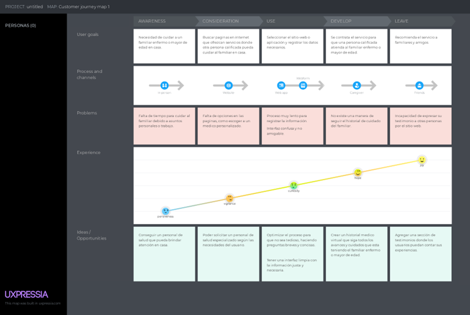
</figure>

<figure style="text-align: center">
    <figcaption >Segmento 2: Profesional de la Salud.</figcaption>
    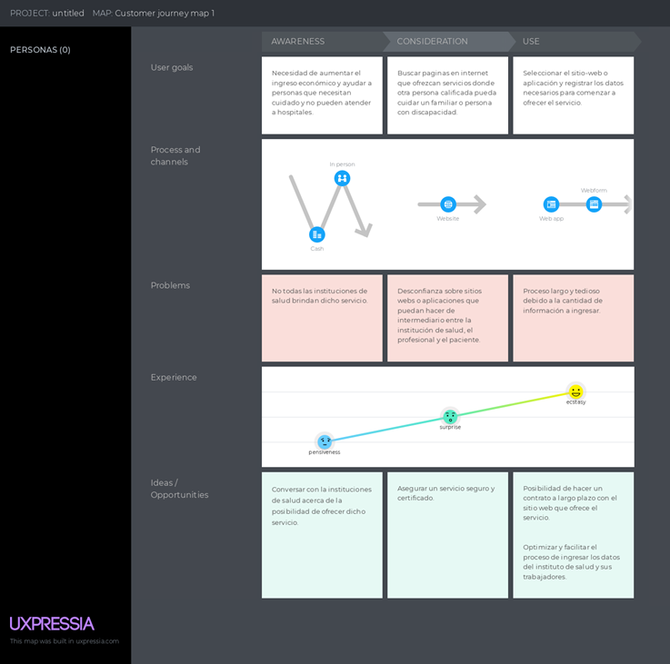
</figure>

### 2.3.4.	Empathy Mapping.
En esta sección se presenta el Empathy Mapping de nuestros 2 segmentos objetivos. Esta herramienta se utilizó porque permite identificar nuestro público objetivo, conocer su entorno y sus necesidades, lo cual nos permite ver el mundo a través de su perspectiva.   

<figure style="text-align: center">
    <figcaption> Segmento 1: Familiar de la persona con limitación.</figcaption>
    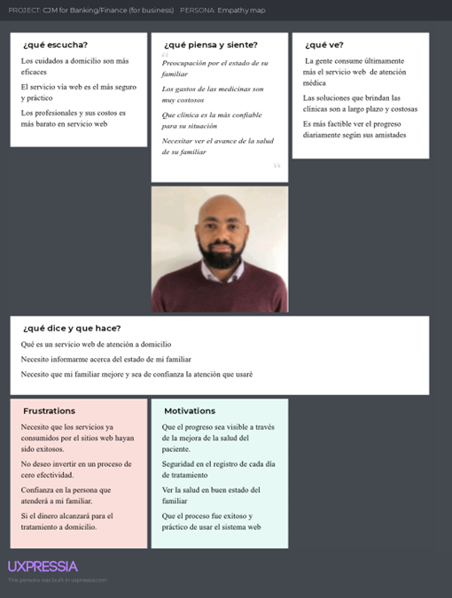
</figure>

<figure style="text-align: center">
    <figcaption > Segmento 2: Profesional de la Salud.</figcaption>
    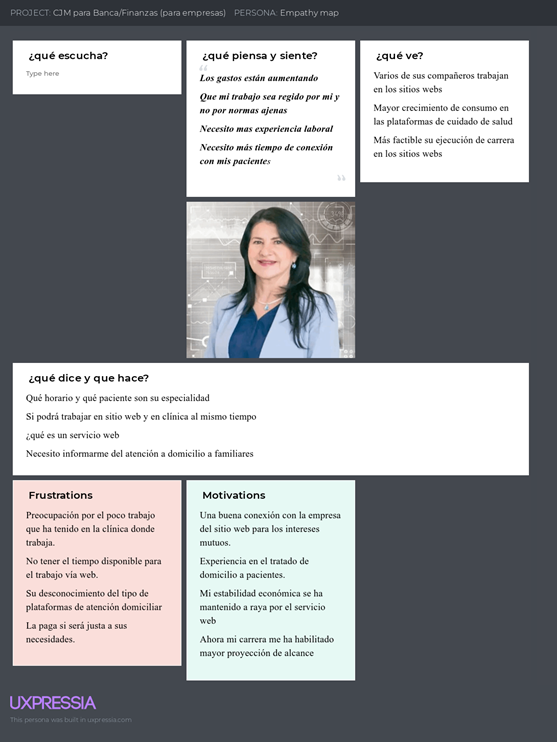
</figure>

### 2.3.5.	As-is Scenario Mapping.
En esta sección, se identificó las fases que podría presentar a nuestros User persona, del cómo se afrontó, sus pensamientos, sus sentimientos para identificar qué soluciones son las más adecuadas para satisfacer sus inquietudes.

<figure style="text-align: center">
    <figcaption> Segmento 1: Familiar de la persona con limitación.</figcaption>
    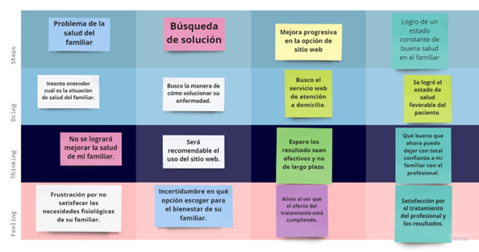
</figure>

<figure style="text-align: center">
    <figcaption > Segmento 2: Profesional de la Salud.</figcaption>
    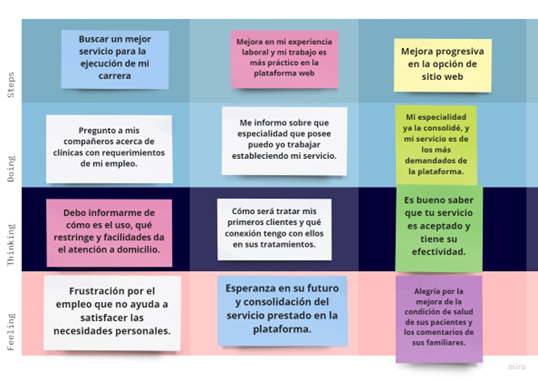
</figure>

